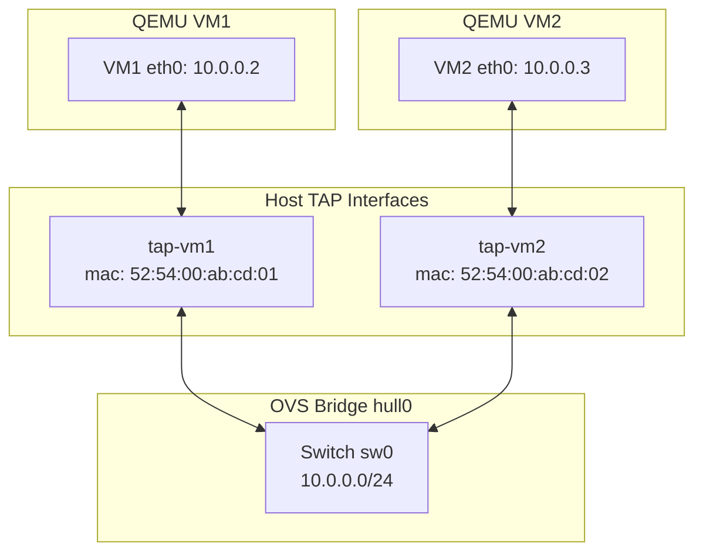
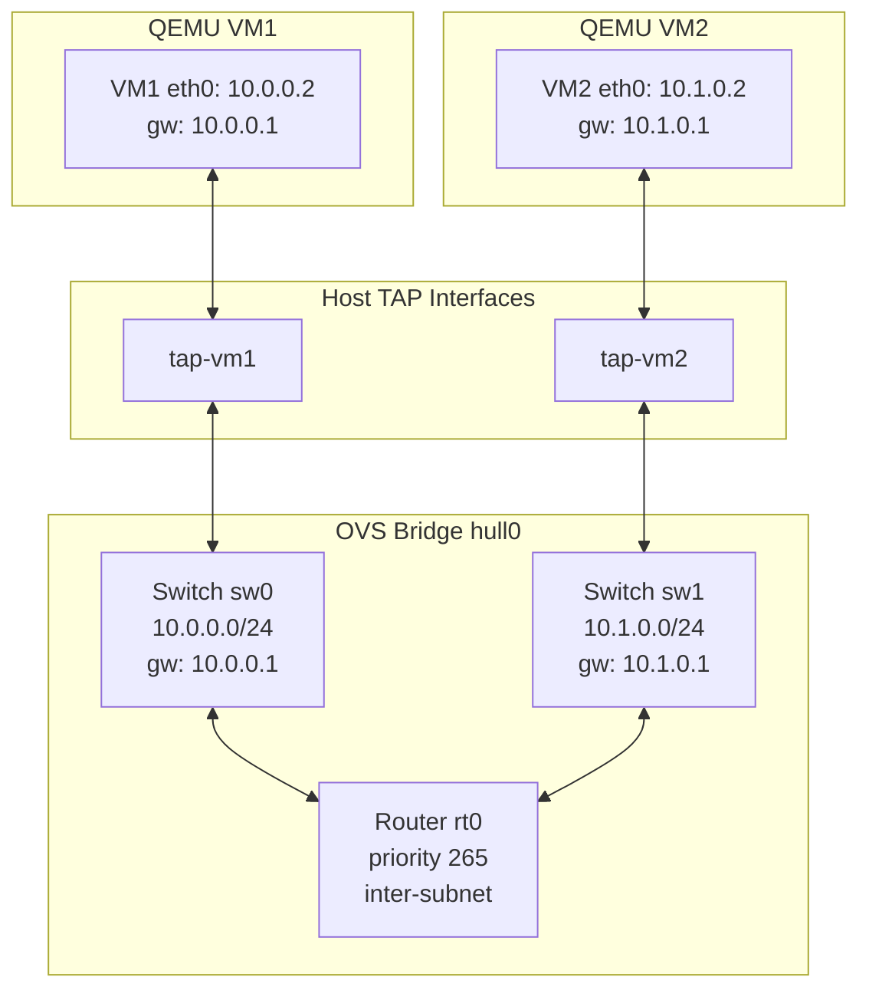
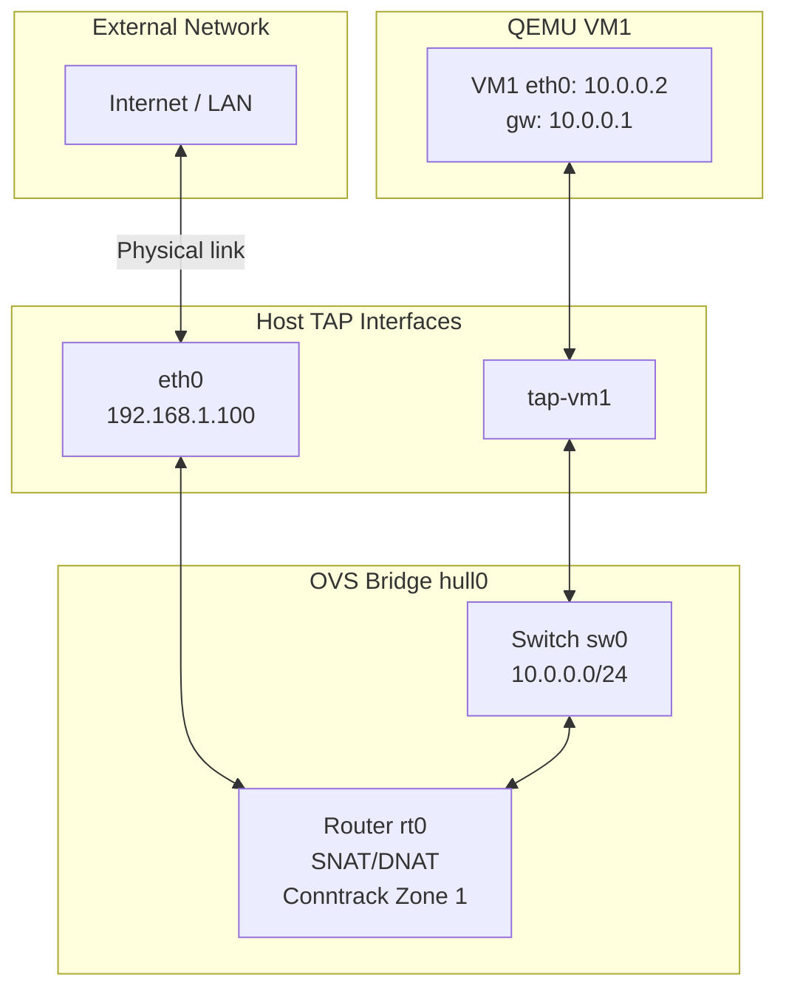

# Connecting QEMU VMs to Hull Networks

Hull TAP interfaces are the bridge between QEMU virtual machines and the OVS fabric. This guide shows three practical examples: VMs on the same switch, VMs routed across subnets, and VMs with external NAT access.

## Prerequisites

- QEMU installed (`qemu-system-x86_64`)
- A disk image for each VM (Alpine Linux, Ubuntu cloud image, etc.)
- Hull initialized (`hull init`)
- Root privileges

## How It Works

Hull creates TAP interfaces on the host via `ip tuntap add dev <name> mode tap` and binds them to the OVS bridge. QEMU connects to these interfaces with `-nic tap,ifname=<name>`, which opens the existing TAP device. Traffic flows:

```
VM virtual NIC -> TAP file descriptor -> kernel TAP interface -> OVS bridge -> other ports
```

Hull auto-allocates IPs for each switch port and records the TAP interface's MAC address. The OVS flows that deliver traffic to each port match on `dl_dst=<mac>`, so **the MAC used by QEMU must match the one Hull recorded**.



---

## Example 1: Two VMs on the Same Switch (L2)

Two VMs on the same subnet, communicating at layer 2.

### Step 1 - Set up Hull

```sh
hull init

hull interface create tap-vm1
hull interface create tap-vm2

hull switch create sw0 10.0.0.0 24

hull switch port create sw0 vm1-port tap-vm1
hull switch port create sw0 vm2-port tap-vm2
```

### Step 2 - Get the MAC addresses

```sh
hull switch port ls
```

Output:

```json
[
  { "name": "vm1-port", "switch": "sw0", "interface": "tap-vm1", "ip": "10.0.0.2", "mac": "52:54:00:ab:cd:01" },
  { "name": "vm2-port", "switch": "sw0", "interface": "tap-vm2", "ip": "10.0.0.3", "mac": "52:54:00:ab:cd:02" }
]
```

Note the MAC addresses. These must be passed to QEMU so the OVS destination flows match.

### Step 3 - Launch VMs

```sh
qemu-system-x86_64 \
  -enable-kvm \
  -m 1G \
  -cpu host \
  -drive file=vm1.img,format=qcow2 \
  -nic tap,ifname=tap-vm1,script=no,downscript=no,mac=52:54:00:ab:cd:01 \
  -nographic &

qemu-system-x86_64 \
  -enable-kvm \
  -m 1G \
  -cpu host \
  -drive file=vm2.img,format=qcow2 \
  -nic tap,ifname=tap-vm2,script=no,downscript=no,mac=52:54:00:ab:cd:02 \
  -nographic &
```

### Step 4 - Configure IPs Inside VMs

Inside VM1:

```sh
ip addr add 10.0.0.2/24 dev eth0
ip link set eth0 up
```

Inside VM2:

```sh
ip addr add 10.0.0.3/24 dev eth0
ip link set eth0 up
```

### Step 5 - Test

From VM1:

```sh
ping -c 3 10.0.0.3
```

---

## Example 2: VMs on Different Subnets, Routed (L3)

Two VMs on different subnets, routed through a Hull router with gateway ARP/ICMP responders.



### Step 1 - Set up Hull

```sh
hull init

hull interface create tap-vm1
hull interface create tap-vm2

hull switch create sw0 10.0.0.0 24
hull switch create sw1 10.1.0.0 24

hull switch port create sw0 vm1-port tap-vm1
hull switch port create sw1 vm2-port tap-vm2

hull router create rt0
hull router attach rt0 sw0
hull router attach rt0 sw1
```

### Step 2 - Get the MAC addresses

```sh
hull switch port ls
```

Note the MACs for each port. Port IPs will be `10.0.0.2` (sw0) and `10.1.0.2` (sw1). The router provides gateway at `.1` for each subnet.

### Step 3 - Launch VMs

```sh
qemu-system-x86_64 \
  -enable-kvm \
  -m 1G \
  -cpu host \
  -drive file=vm1.img,format=qcow2 \
  -nic tap,ifname=tap-vm1,script=no,downscript=no,mac=<vm1-mac-from-hull> \
  -nographic &

qemu-system-x86_64 \
  -enable-kvm \
  -m 1G \
  -cpu host \
  -drive file=vm2.img,format=qcow2 \
  -nic tap,ifname=tap-vm2,script=no,downscript=no,mac=<vm2-mac-from-hull> \
  -nographic &
```

### Step 4 - Configure IPs and Routes Inside VMs

Inside VM1:

```sh
ip addr add 10.0.0.2/24 dev eth0
ip link set eth0 up
ip route add default via 10.0.0.1
```

Inside VM2:

```sh
ip addr add 10.1.0.2/24 dev eth0
ip link set eth0 up
ip route add default via 10.1.0.1
```

The gateway IPs (`10.0.0.1` and `10.1.0.1`) are handled by Hull's in-switch ARP and ICMP responders -- no host-side process needed.

### Step 5 - Test

From VM1:

```sh
# Ping the gateway
ping -c 3 10.0.0.1

# Ping VM2 across subnets
ping -c 3 10.1.0.2
```

---

## Example 3: VM with External Access via NAT

A VM on a Hull switch reaches external networks through a router uplink with SNAT.



### Step 1 - Set up Hull

```sh
hull init

hull interface create tap-vm1

hull switch create sw0 10.0.0.0 24

hull switch port create sw0 vm1-port tap-vm1

hull router create rt0
hull router attach rt0 sw0

# Set uplink to a physical interface with external connectivity
hull router link set rt0 eth0 192.168.1.100 52:54:00:ab:cd:ef

# Add a route for outbound traffic: source subnet, destination, next hop
hull router route add rt0 10.0.0.0/24 0.0.0.0/0 192.168.1.1
```

Replace `eth0`, `192.168.1.100`, and the MAC with your actual uplink interface details. The MAC must match the uplink interface's hardware address. The route's next hop (`192.168.1.1` in this example) must be reachable on the uplink's network -- it's typically your LAN's default gateway.

### Step 2 - Get the MAC address

```sh
hull switch port ls
```

Note the MAC for `vm1-port`.

### Step 3 - Launch VM

```sh
qemu-system-x86_64 \
  -enable-kvm \
  -m 1G \
  -cpu host \
  -drive file=vm1.img,format=qcow2 \
  -nic tap,ifname=tap-vm1,script=no,downscript=no,mac=<vm1-mac-from-hull> \
  -nographic &
```

### Step 4 - Configure IP and Route Inside VM

Inside VM1:

```sh
ip addr add 10.0.0.2/24 dev eth0
ip link set eth0 up
ip route add default via 10.0.0.1
```

### Step 5 - Test

From VM1:

```sh
# Ping the gateway
ping -c 3 10.0.0.1

# Ping external network (outbound traffic is SNAT'd to 192.168.1.100)
ping -c 3 8.8.8.8
```

---

## Tear Down

When done, clean up everything:

```sh
# Stop VMs (Ctrl+A X in QEMU, or kill the processes)

# Remove Hull configuration
hull deinit
```

`hull deinit` deletes the OVS bridge, all TAP interfaces, and the data directory.

## Important Notes

- **MAC must match** -- Hull records the TAP interface MAC when creating a port. The OVS destination flows (`priority=240,dl_dst=<mac>`) use this MAC. If QEMU uses a different MAC, the VM receives no traffic. Always pass `mac=<mac-from-hull>` to QEMU.
- TAP interfaces must be created by Hull **before** QEMU connects to them -- Hull manages the DB record and OVS port binding
- The `-nic tap` shorthand replaces the older `-netdev tap,... -device virtio-net-pci,...` pair
- IP allocation is deterministic -- first available IP in the subnet after `.0`, `.1`, and broadcast
- If you restart QEMU, the TAP interface persists in the database. Just reconnect with the same `ifname` and `mac`
