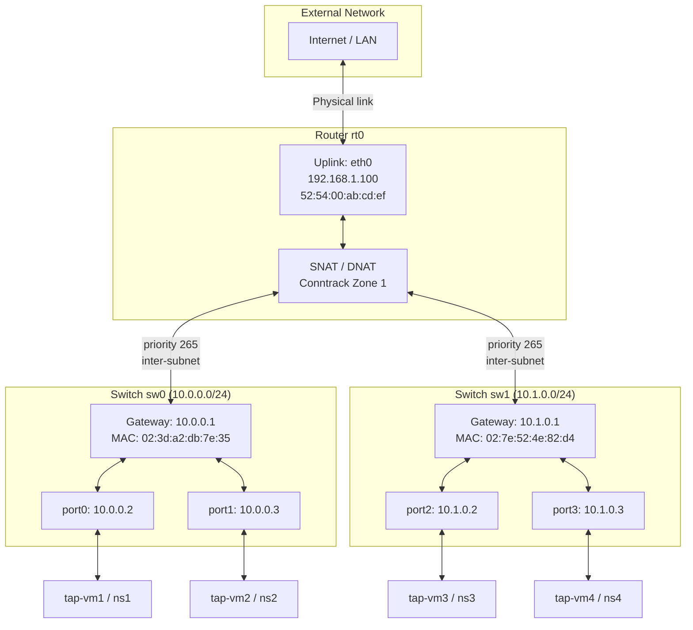

# Getting Started with Hull

Hull is a rootless CLI client for lightweight Open vSwitch (OVS) network management. It provides high-level abstractions for L2 switches, L3 routers, and TAP interfaces, but it sends every operation to `hulld`, which owns SQLite state, TAPs, and OVS sync. All CLI output is JSON.

## Architecture



## Prerequisites

- **Open vSwitch** installed and running (`ovs-vsctl`, `ovs-ofctl` available on PATH)
- **Root privileges** for running `hulld`
- **Rust toolchain** (if building from source)

## Quick Start

### 1. Initialize Hull

Start the daemon, then create the OVS bridge, SQLite database, and config file:

```sh
sudo hulld
hull init
```

This creates:
- An OVS bridge named `hull0` (configurable via `HULL_BRIDGE`)
- A SQLite database (`hull.db`) in the data directory
- A config file (`hull.json`)
- A daemon socket at `{HULL_PATH}/hulld.sock`

### 2. Create TAP Interfaces

TAP interfaces are virtual network interfaces on the host:

```sh
hull interface create tap0
```

### 3. Create an L2 Switch

A switch represents a broadcast domain with a subnet:

```sh
hull switch create sw0 10.0.0.0 24
```

### 4. Create a Switch Port

Bind an interface to a switch. The IP is auto-allocated from the subnet:

```sh
hull switch port create sw0 port0 tap0
```

### 5. Create an L3 Router

```sh
hull router create rt0
```

### 6. Attach the Switch to the Router

```sh
hull router attach rt0 sw0
```

### 7. List Everything

```sh
hull interface ls
hull switch ls
hull switch port ls
hull router ls
```

### 9. Tear Down

Remove the OVS bridge, TAP interfaces, and daemon-owned state:

```sh
hull deinit
```

## Environment Variables

| Variable | Description | Default |
|---|---|---|
| `HULL_PATH` | Root directory for all Hull data | See [Data Path Resolution](#data-path-resolution) |
| `HULL_BRIDGE` | Override the OVS bridge name | `hull0` |

### Data Path Resolution

Hull resolves its data directory in this priority order:

1. `HULL_PATH` environment variable
2. `$XDG_DATA_HOME/hull`
3. `/var/lib/hull`

## Complete Example: Two Subnets with Inter-Subnet Routing

```sh
# Initialize
sudo hulld
hull init

# Create two TAP interfaces
hull interface create tap0
hull interface create tap1

# Create two switches on different subnets
hull switch create sw0 10.0.0.0 24
hull switch create sw1 10.1.0.0 24

# Bind interfaces to switches (IPs auto-allocated: 10.0.0.2 and 10.1.0.2)
hull switch port create sw0 port0 tap0
hull switch port create sw1 port1 tap1

# Create a router and attach both switches
hull router create rt0
hull router attach rt0 sw0
hull router attach rt0 sw1

# Sync everything (only needed if flows are out of sync)
# hull sync

# Check the results
hull switch ls
hull router ls

# Clean up
hull deinit
```

## Expected JSON Output

All Hull commands output pretty-printed JSON.

**Success response:**

```json
{
  "status": "success",
  "message": "Created switch",
  "name": "sw0",
  "ip": "10.0.0.0",
  "mask": 24
}
```

**Error response:**

```json
{
  "status": "error",
  "message": "Switch 'sw0' already exists"
}
```

**List response (e.g. `hull interface ls`):**

```json
[
  { "name": "tap0" },
  { "name": "tap1" }
]
```
